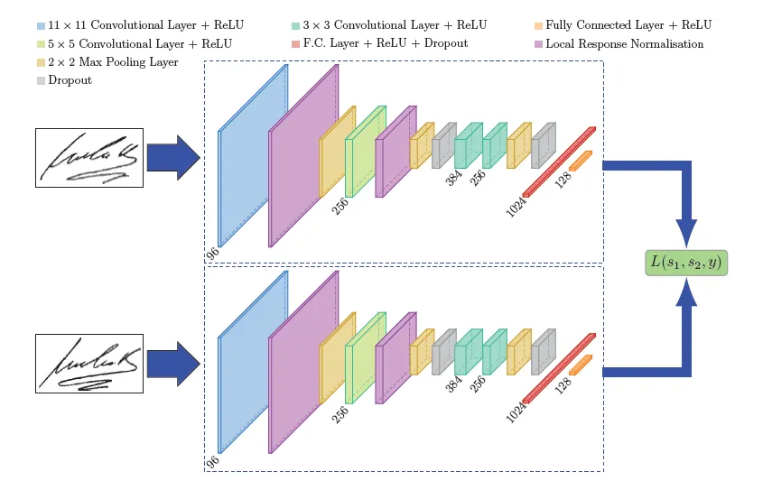

# Siamese Model



*출처: [A friendly introduction to Siamese Networks](https://towardsdatascience.com/a-friendly-introduction-to-siamese-networks-85ab17522942)*

## Abstract

Siamese Model(Network)는 2개의 입력을 weight를 공유하는 siamses network를 이용하여 임베딩 값을 얻는 방식입니다. siamese 구조는 이미지 분야에서 먼저 제안되어 contrastive loss와 같은 objective를 사용하여 그 성능을 증명했고 현재는 자연어 분야에도 다양하게 사용하고 있는 구조입니다.  

본 레포지토리에서는 siamese network와 classification, regression, triplet loss를 결합하여 학습한 [sentence-BERT](https://arxiv.org/abs/1908.10084)를 코드로 직접 구현하였고 학습 및 평가를 수행 하는데 목표를 하고 있습니다.  


## Dataset

사용한 데이터는 Huggingface에 업로드 된 `all-nli`, `bio-nli`, `bio 기사제목 - 본문 pair`를 사용했습니다. 저는 Bio 쪽에 특화 된 모델을 목표로 하기 때문에 추가적인 데이터를 사용했습니다.  

- `all-nli` : 900k

- `bio-nli` : 500k

- `bio 기사제목 - 본문` : 500k


## Tree

```
.
├── README.md
│
├── requirements.txt
│
├── main.py                 # running file
│
├── config                  # configuration folder
│   └── config.yaml
│
├── data                    # data folder
│   └── data_samples.csv
│
├── models                  # modeling folder
│   ├── __init__.py
│   └── modeling.py
│
├── trainer                 # trainer folder
│   ├── __init__.py
│   │
│   ├── base.py             # base trainer
│   └── trainer.py          # specific trainer
│
└── utils
    ├── __init__.py
    ├── data_utils.py       # dataset
    ├── file_utils.py       # create & remove
    ├── metric_utils.py     # metrics
    └── train_utils.py      # collate & dataloader
```

## QuickStart

### Train

```
python main.py --config config/config.yaml
```

### Test

```
python main.py --checkpoint <checkpoint path> --mode test
```


## Training Result Samples

### Loss History

### Classification Loss History

### Cosine Loss History

### Triplet Loss History
